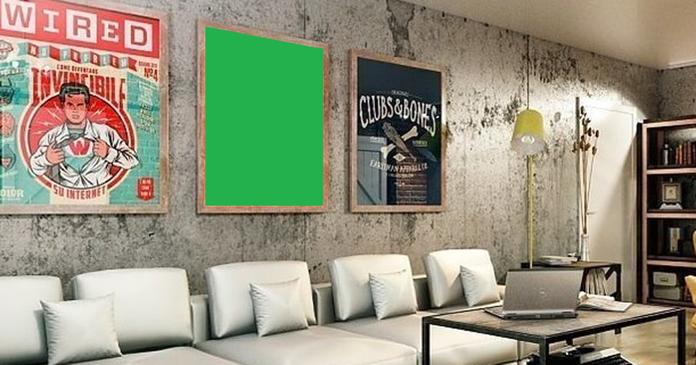
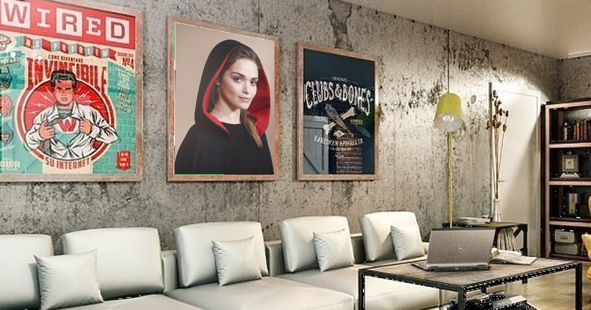

# Automatic inserting image in green rectangles in other image taking into account their geometric distortions.

## For example:

The image to be inserted: 

The image into which is inserted:

Resulting image:

